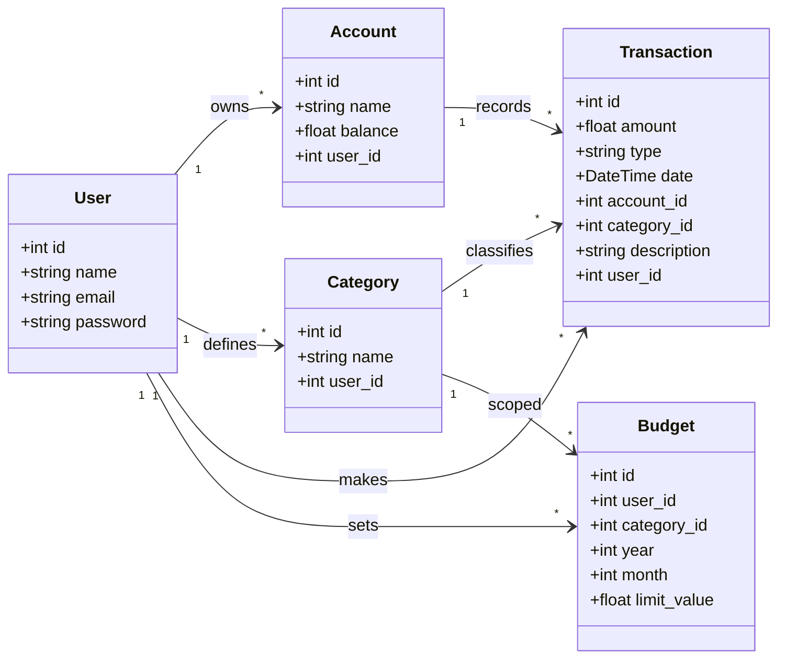
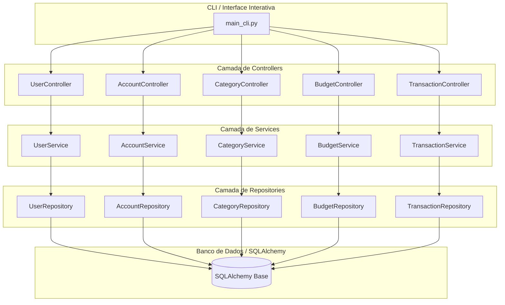

# Diagramas do Projeto

Este diretório contém diagramas simples (Mermaid) representando as entidades e a arquitetura do projeto.

## Como visualizar

No VS Code, você pode visualizar Mermaid diretamente instalando a extensão "Markdown Preview Mermaid Support" ou usando o preview padrão do Markdown quando suportado.

- Abra os arquivos `.mmd` e use o preview de Markdown (Ctrl+Shift+V)
- Ou visualize os blocos Mermaid a seguir diretamente neste README

## Diagrama ER (Entidades e Relacionamentos)

## Arquitetura em Camadas

## Dicas

- Você pode exportar os diagramas para PNG/SVG usando ferramentas como `mmdc` (Mermaid CLI) ou extensões do VS Code.
- Para manter os diagramas atualizados, edite os arquivos `.mmd` conforme o modelo de dados evoluir.
